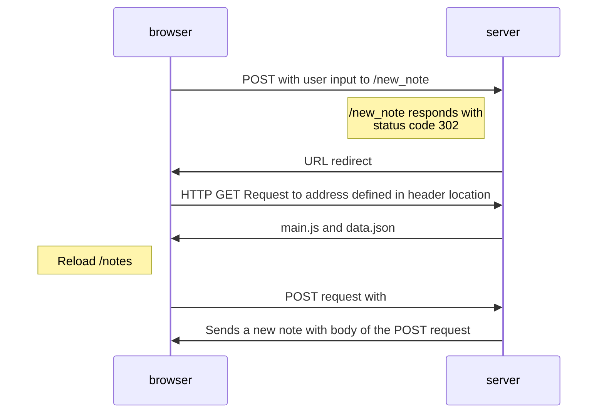

```mermaid
	sequenceDiagram
	participant browser
    participant server

	browser->>server: POST with user input to /new_note
	Note left of server: /new_note responds with<br/>status code 302

    server->>browser: URL redirect

	browser->>server: HTTP GET Request to address defined in header location
    server->>browser: main.js and data.json
	Note left of browser: Reload /notes
    browser->>server: POST request with
	server->>browser: Sends a new note with body of the POST request

```
